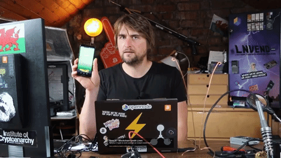
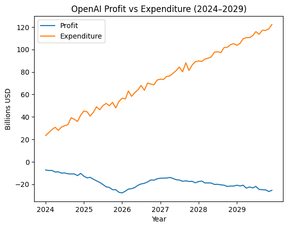
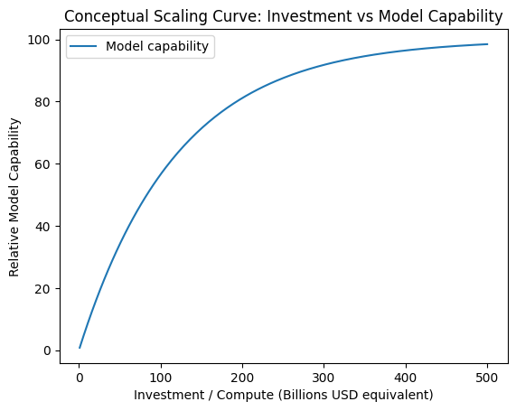
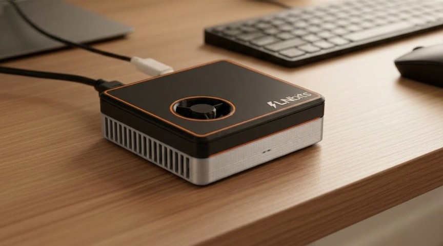

<!-- _class: title-slide -->
## Building without permission in the age of AI

---

## About me
### Builder, educator, tinkerer, CEO LNbits.com Nostr.com

  
  
  

---

## A brief history of free and open-source

- **1970s** “Sharing culture”  
  Homebrew Computer Club (pre–open source)
- **1976:** Bill Gates, “An Open Letter to Hobbyists”  
  “People copying software is stealing”
- **1983:** GNU Project (Richard Stallman)  
  **1985:** GNU GPL v1  
  - Must share source  
  - Keeps software open  
  - Requires attribution  
- **1987:** MIT License (Massachusetts Institute of Technology)  
  - Do anything (even use in closed software)  
  - Just keep attribution  

<blockquote>
Software as knowledge not property
</blockquote>

---

## FOSS as the commons

- Bitcoin and Nostr require no permission
- Open protocols keep capital answerable to users
- Adam Smith Invisible Bitch Slap (Ben™)
- Closed platforms lock people in, enshittify, push users to FOSS

<blockquote>
Nurture the commons and get rewarded, exploit it and get a slap
</blockquote>

---

## The good: vibe coding

### Build like it’s 1975 🎵

- Culture of building again
- Gonzo developing (Ben™)
- Cost of producing software is low (allegedly)

---

## Doomer time...

---

## The bad: hype, myth, limitations

- Licensing implications + code theft
   - Licenses matter!
- !context === slop. Agents get dumb fast
- Turing hype: LLMs are great at sounding clever
- AI hallucinates and is unpredictable
- VC/CEO crack - dump workforce, force useless "AI" products on customers

| Risk | Result |
| --- | --- |
| License breach | Everyone sues each other |
| AI over-pumped | Later market correction |
| Skill atrophy | Bleed engineering talent |

---

## The ugly: AI industry is a huge bubble

- Unsustainable AI business models (current 10x discount before profit)
- AGI promise built on sand/assumptions (enough power then AGI)
- Rising energy/resource costs
- Capital intensity problem facing frontier AI companies
- Gov tax breaks
- Slow/expensive infrastructure rollout
- If/when promises are kept capitalism breaks

| Risk | Result |
| --- | --- |
| Poor AI economics | Users won't pay actual cost |
| AI plateaus | VCs lose return/hyper-enshittification |
| Industry buckles under own falsehoods | AI development grinds to a halt |

---

## Reality

- Make hay while the sun shines 🤷
- Don't bleed engineers
- Build like it's 1975
- **context**, **context**, **context** ideas are scarce, tokens are unrealistically cheap

<blockquote>Replacing a developer with AI is like replacing a carpenter with a hammer
</blockquote>

---

## Adjusting to current reality

- **API is the UI for AI**
- Some systems should stay dumb, narrow, and predictable
- Be mindful we are in a blip that could pop
- We still exist in a world of friction, removing friction has value
- Engineers are not paid just to type code
- AI is weak outside the training set
- Humans have material reality context

---

## Demo

### Video will go here
